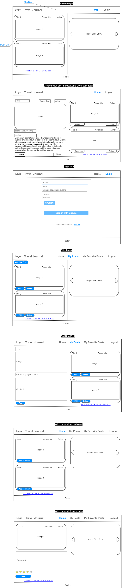

# travel-journal
Guide for travelers around the world. 

# Problem Statement (Owner: Product)
# Scope:
We travel to make us happy. Therefore, it is important for millions of travelers to be able to find an unforgettable experience without inconveniences. 

# Impact: 
Currently, travellers need to search though multiple sites to find the latest updates or travel tips. There is no "go-to" site or application for the travel community for reviewing recent user trips. If this information is lacking, travellers can find themselves in a predicament when they arrive at their destination. 

# Causes: 
When travellers are spending time fixing their travel problems, they are not spending time enjoying their trip. Consequently, the traveller will feel that they have wasted their time and money. 

# Other solutions: 
Through our application, travellers have a platform to share their experiences. Prospective travellers can then plan their trips in advance to avoid any inconveniences by using the shared content, comments, and reviews of other user's trips.

# Design a Solution (Owner: Database & Frontend)

## Overview of travel-journal website that will be built
This project is to build a blog website for travelers. It is a collection of the interesting and useful information of all favorite places where travelers have unforgettable experiences when they visited there.
Each post of any traveler will be review, comment and rating by users who are interested in the post.
More valuable posts with positive comments and rating from every user in the world are more valuable data for this website.
## Description of the Databases, Collections, Schema, Source of data
  Database name: travel-journal (in MongoDB Atlas);
  Collections: users, posts, comments, myfavoriteposts
  Collection Schemas:
  1/ users {
      userid (_id): string,
      firstName: string,
      lastName: string,
      email: string,
      password: string,
      image: string,
      createdAt: timeStamp,
      updatedAt: timeStamp
    };
  2/ posts {
      postid (_id): string,
      title (title of the post): string,
      city: string,
      country: string,
      image: string,
      content (unforgettable memories): string,
      airBnBPrice: number,
      hotelPrice: number,
      couplePrice: number,
      familyPrice: number
      userId: string,
      createdAt: timeStamp,
      updatedAt: timeStamp
    };
  3/ myfavoriteposts {
      postId (_id): string,
      userId: string,
      createdAt: timeStamp
    };

  4/ comments {
      commentid (_id): string,
      user (userId): string,
      post (postId): string,
      comment: string,
      rating (from 1 to 5 stars): number,
      date: timeStamp
    };

## List of endpoints
  create; // Create a new user
  updateUser;
  findByCredentials; // login by user email & password
  getMe; // Get user by userid
  getAllPosts;
  getPostsByUser;
  getPostByPostId;
  createPost;
  updatePost;
  deletePost;
  createComment;
  getCommentsByPost;
  createComment;
  deleteComment;
  getAllMyFavoritePosts;
  createMyFavoritePost;
  deleteMyFavoritePost;

## External tools (not libraries like React, but separate systems or third party tools, like a second database)
For Front-End: redux-toolkit, bootstrap, react-bootstrap, react-redux, react-toastify, react-paginate, react-icons, axios, data-fns, react-scripts,...

For Back-End: mongoose, express, express-async-handler, bcryptjs, dotenv, jsonwebtoken, nodemon, concurrently, multer, multer-s3, @aws-sdk/client-s3, aws-sdk,...

## Describe the functionality that the front end app will have
Home page: display all posts with comments and rating for each post and searching feature
Login page;
Register page;
Profile page;
UserHome page: My Posts - display all posts of loggedin user;
FavoritePosts page: display all the user's favorite posts;
PostDetail page: display a single post with comment list for the post.

# Plan a work timeline (Owner: Project Manager)
## High level work timeline. List the work items that you plan to complete, organized by each of the 5 remaining weeks until the presentation

